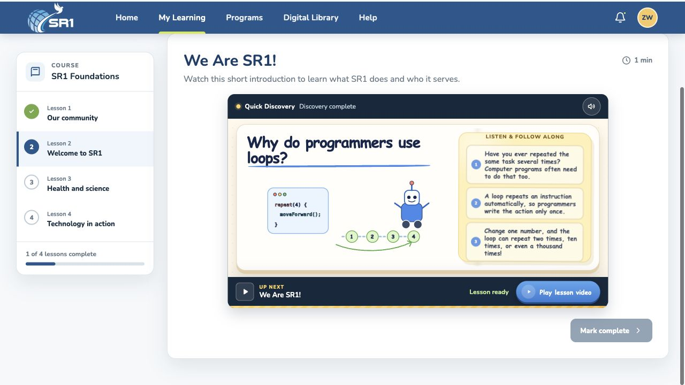

# SR1 Lesson Loader

A student-friendly educational loading experience created for the SR1
Full-stack Engineer Assessment. It turns a simulated 20-second lesson-video
delay into a short, narrated STEM discovery for K-12 learners.

[View the live prototype](https://zilongwang-uno.github.io/sr1-learning-loader/)



## The experience

When a student selects the lesson video, the player becomes a `Quick Discovery`
for 20 seconds. A three-part explanation is read aloud while captions and an
animated illustration develop in sync. The persistent `Up next` bar keeps the
lesson title visible and communicates that the video is still loading.

When loading finishes, the experience pauses on a clear `Play lesson video`
button instead of starting the video unexpectedly.

## Key features

- Three animated discoveries covering science, programming, and coordinates
- Synchronized narration, captions, and visual states
- Random topic rotation without repeats until every topic has been shown
- Narration mute control that does not pause the visual sequence
- User-controlled transition from the discovery to the lesson video
- Responsive layouts for desktop, tablet, portrait mobile, and landscape mobile
- Keyboard focus states, semantic controls, readable contrast, and
  reduced-motion support
- Lesson completion feedback with updated progress and a short celebration

Topic history is stored in `localStorage`. Once the learner has viewed the full
set, the cycle resets automatically.

## Design decisions

- The waiting experience stays inside the video player so the page does not
  shift or lose context.
- `Quick Discovery`, loading status, and `Up next` distinguish the temporary
  activity from the lesson itself.
- Narration and matching captions support different reading preferences.
- Students can mute narration without pausing the visual explanation.
- The lesson video waits for a second user action after loading, giving students
  time to finish reading before moving on.
- Mobile learners receive a landscape suggestion before the discovery begins.
  Portrait mode remains available, while landscape mode uses the available
  viewport more like a video player.

## Technical approach

The project uses plain HTML, CSS, and JavaScript with no dependencies or build
step:

- Inline SVG provides lightweight, topic-specific animation.
- The Web Speech API provides narration using an available English system voice.
- `requestAnimationFrame` synchronizes the 20-second loading progress and
  discovery stages.
- `localStorage` manages non-repeating topic rotation.
- YouTube is embedded only after the discovery is complete.
- Discovery content is separated into `topics.js`, so another topic can be added
  without changing the loading controller.

## Run locally

```bash
python3 -m http.server 4173
```

Open `http://localhost:4173`.

To review a specific discovery without changing topic history:

- `http://localhost:4173/?topic=leaves`
- `http://localhost:4173/?topic=loops`
- `http://localhost:4173/?topic=coordinates`

## Project structure

```text
index.html   Page structure and lesson content
styles.css   Layout, visual system, and responsive styles
topics.js    Discovery text and inline SVG illustrations
script.js    Loading sequence, narration, topic rotation, and interactions
```

No package installation or build step is required.
